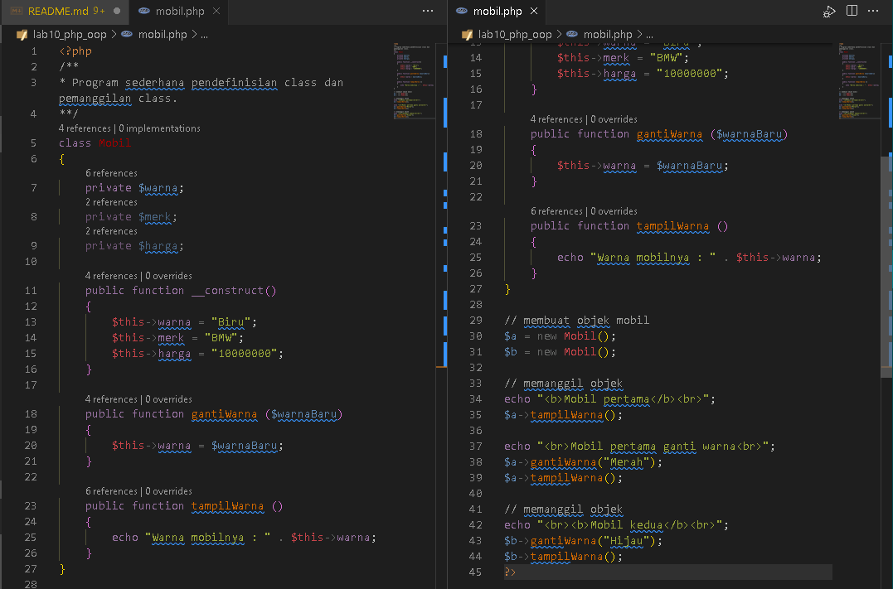
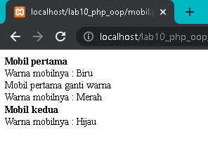
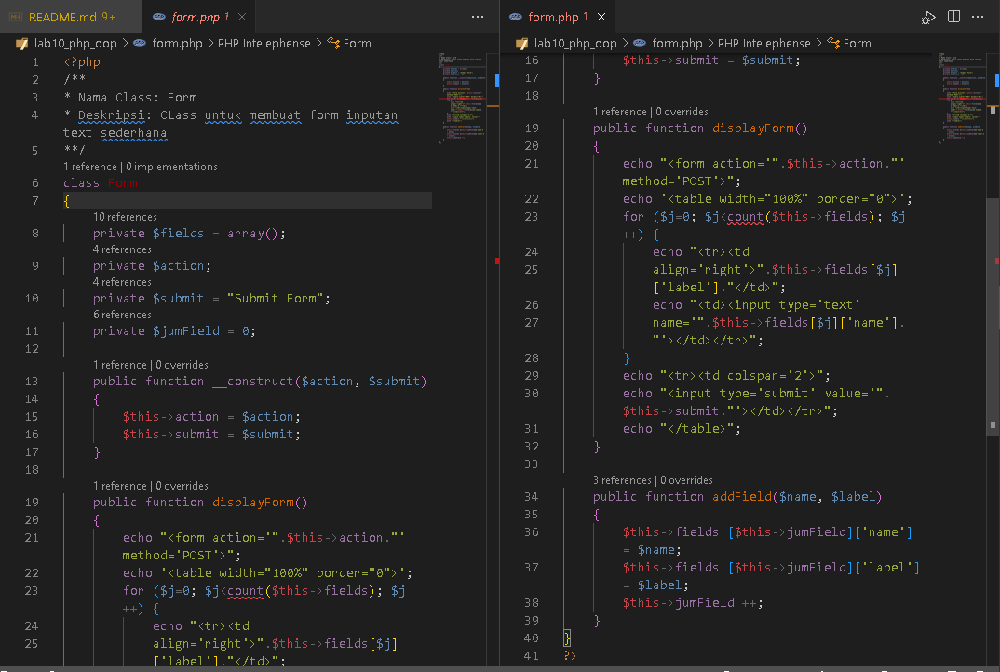
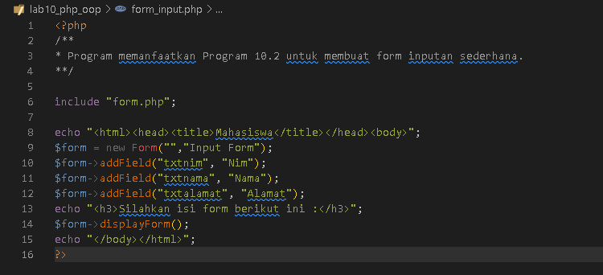
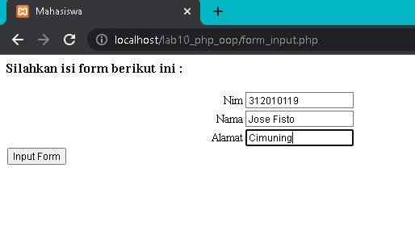

	PEMROGRAMAN WEB

	TUGAS PRATIKUM 10

	Dosen Pengampu : Agung Nugroho, M.Kom

 
	<b>Tugas untuk memenuhi syarat penilain pada Pert-11</b>

	

                 Nama  : Jose Fisto

                 NIM   : 312010119

                 Kelas : TI.20 A.1

 
 

	<b>UNIVERSITAS PELITA BANGSA</b>

	<b>FAKULTAS TEKNIK</b>

	<b>TEKNIK INFORMATIKA</b>

	<b>TA 2021 / 2022</b>

  

  

# Laporan Praktikum 10 | PHP OOP

## 1. Buat file dalam direktori lab10_php_oop
Buat file dengan nama mobil.php, dan ikuti code berikut ini :

	

Hasil / Output :

	

## 2. Buat file form.php

berikut kode / syntaxnya :

	

## 3. Buat file form_input.php

isikan kode / syntax seperti di bawah ini :

	

Hasil / Output :

	

